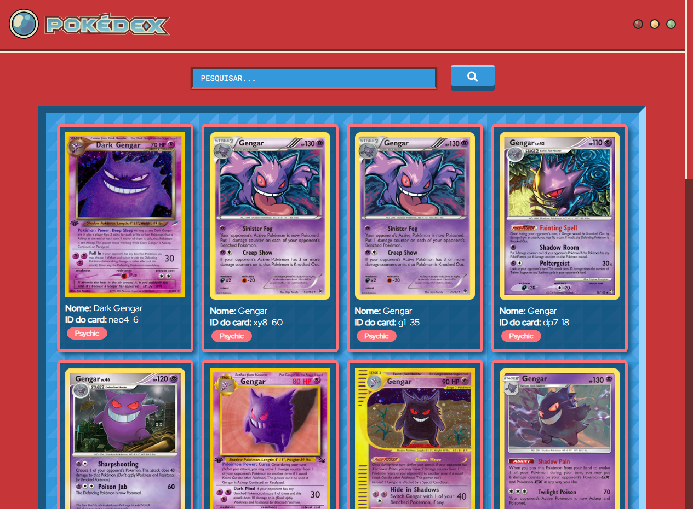

# Pokedex

Projeto gerado com [Angular CLI](https://github.com/angular/angular-cli) version 13.2.2.

Baseado em uma Pokédex, a aplicação lista cartas de Pokémon TCG utilizando a API [Pokemon TCG API](https://docs.pokemontcg.io/)

Este projeto possui alguns testes unitários.
Utilize `ng test` para executar os testes via [Karma](https://karma-runner.github.io).

